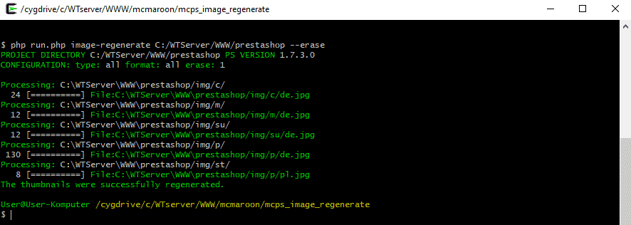

# PrestaShop Cli Image Regenerator

Compatible with versions 1.6.x - 1.7.x

### Installing

1) Clone or [download](https://github.com/mcmaroon/mcps_image_regenerate/archive/master.zip) a repository

2) Enter the cd mcps_image_regenerate directory

3) Run "[composer install](https://getcomposer.org/)" in the command line.

### Usage

`php run.php --help`

-Optionally update the `PATH` environment variable to contain the mcps_image_regenerate directory.

`psimgr --help`

### Example

`php run.php --dir=C:/WTServer/WWW/prestashop --erase`

or

`psimgr --dir=C:/WTServer/WWW/prestashop --erase`

or being in the main directory of a prestashop project

`psimgr --erase`

### Usage

## Authors

* **Marek Ciarkowski** - [mcmaroon](https://github.com/mcmaroon)

## License

This project is licensed under the MIT License - see the [LICENSE](LICENSE) file for details